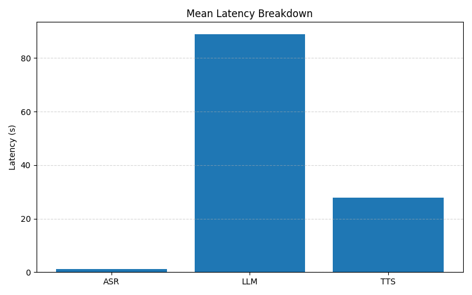
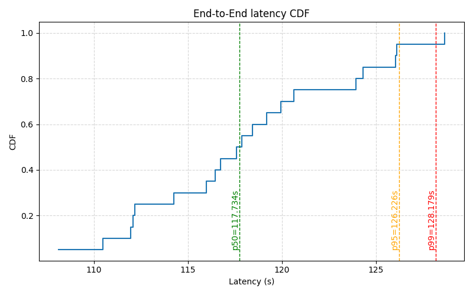

# Experiment Report: baseline

**Genenrated at: 2025-12-08 15:26:35.186171**

## Summary Metrics
```json
{
  "experiment": "baseline",
  "run_id": "baseline_67ecd4",
  "num_samples": 20,
  "asr_latency": {
    "mean": 1.255016028881073,
    "median": 1.3091400861740112,
    "p95": 1.8403878211975098,
    "p99": 1.8403878211975098
  },
  "llm_latency": {
    "mean": 88.98573440313339,
    "median": 88.92446386814117,
    "p95": 91.92471528053284,
    "p99": 91.92471528053284
  },
  "tts_latency": {
    "mean": 27.815789103507996,
    "median": 27.915833950042725,
    "p95": 35.45513892173767,
    "p99": 35.45513892173767
  },
  "total_latency": {
    "mean": 118.05653953552246,
    "median": 117.73418164253235,
    "p95": 128.66794753074646,
    "p99": 128.66794753074646
  },
  "asr_wer_mean": 0.25903554778554777,
  "tts_utmos_mean": 3.30419921875
}
```

## Latency Breakdown (Mean)


## LLM GPU Memory Usage Per Trial


## Latency CDF (p50/p95/p99)

