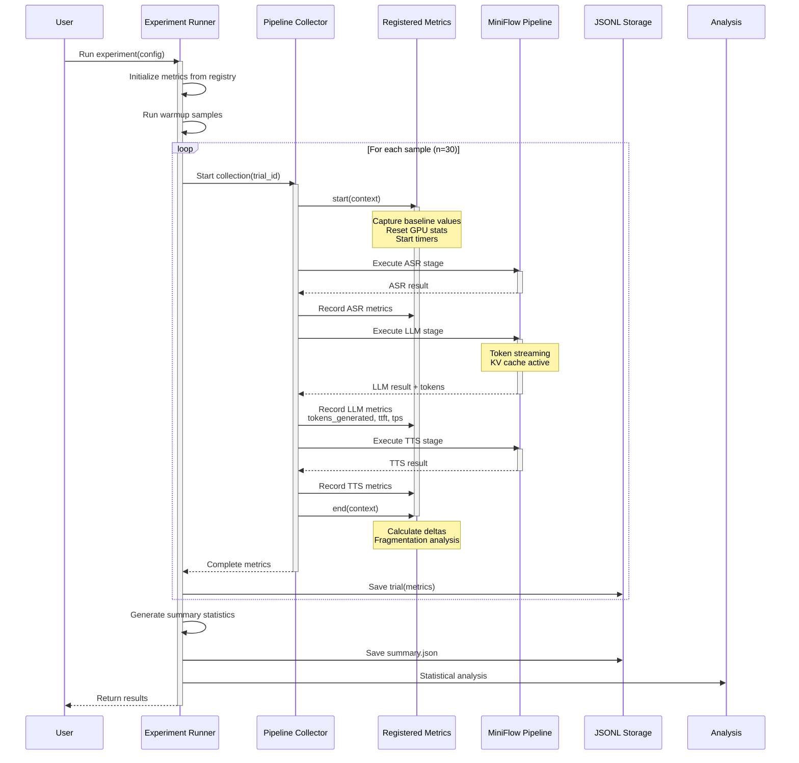
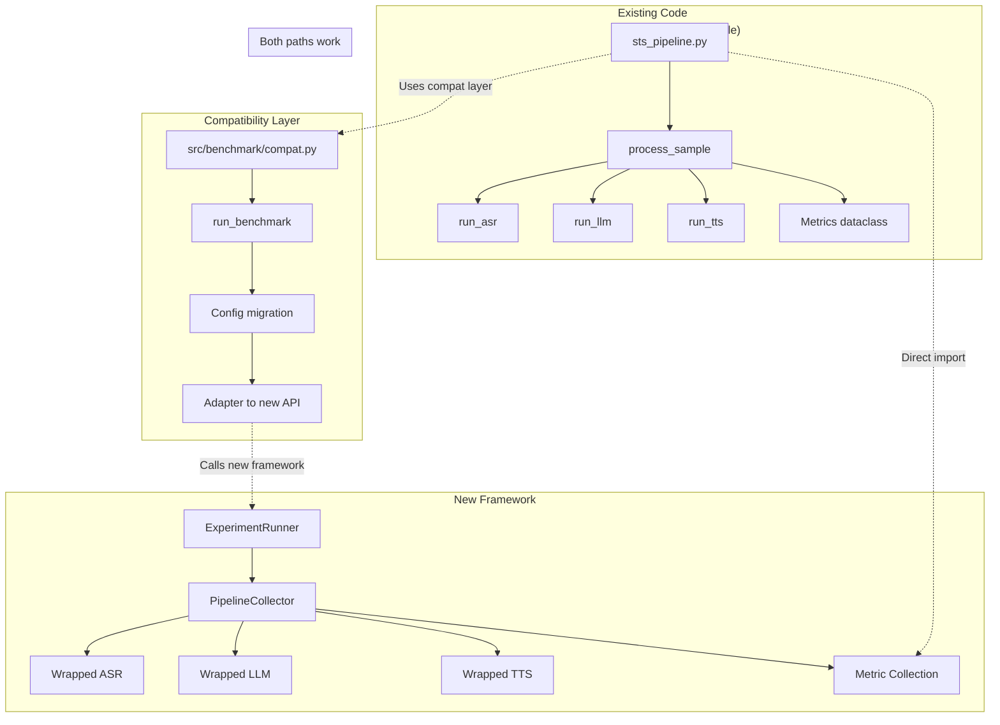
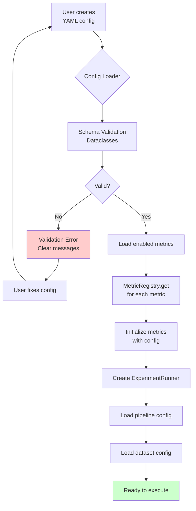
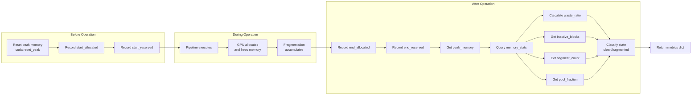
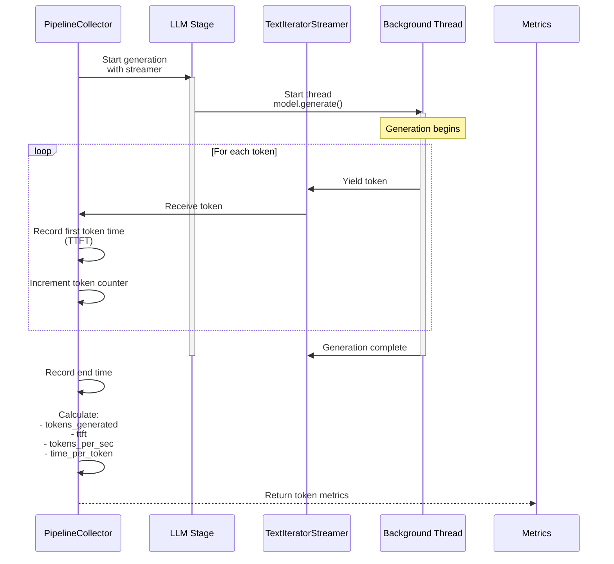
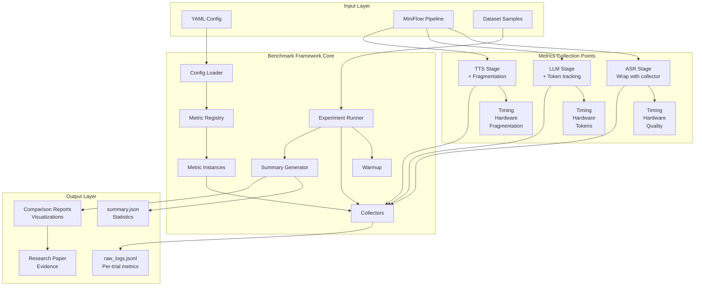
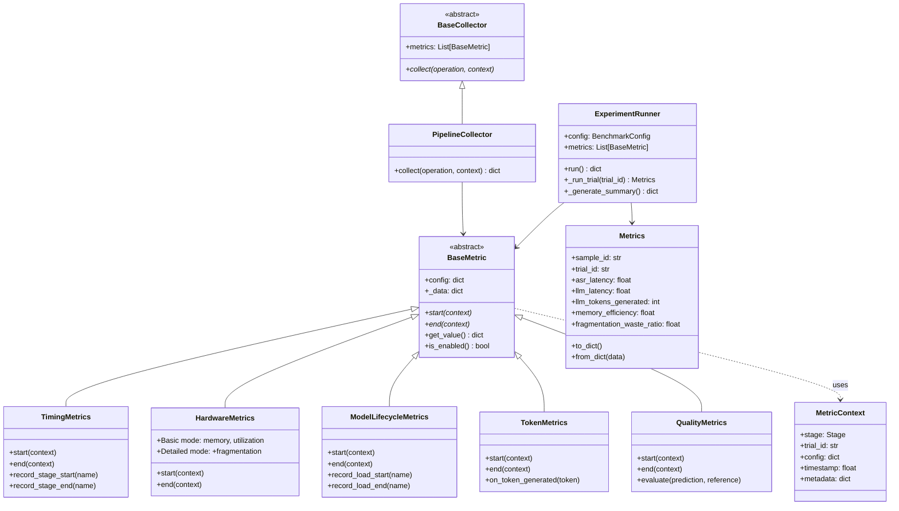
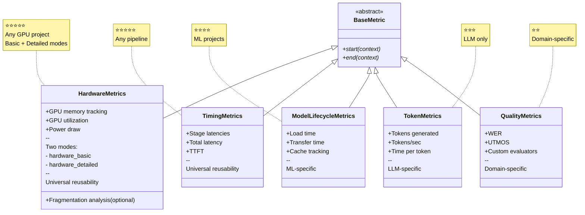
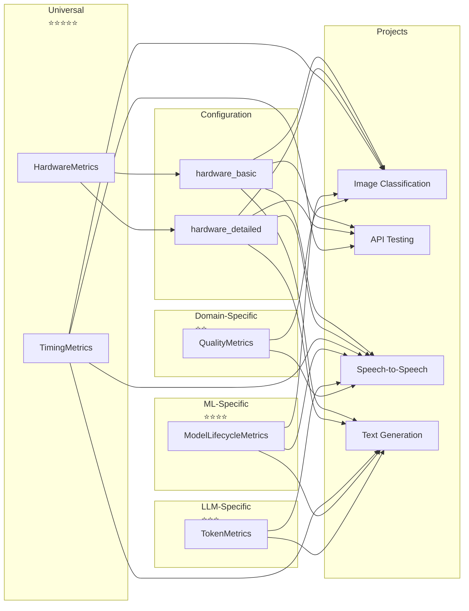

# MiniFlow Benchmark Framework Implementation Design

## Design Session Summary

**Date:** January 2026
**Status:** Architecture Design Phase
**Objective:** Design modular, reusable benchmark framework for MiniFlow Phase-1 experiments
**Scope:** KV cache, Flash Attention, Model Size optimizations with research-grade metrics

---

## Architecture Overview

### Core Principles

1. **Separation of Concerns** - Each module has single responsibility
2. **Plugin Architecture** - Add new metrics without touching core code
3. **Configuration-Driven** - Behavior controlled via YAML config
4. **Backwards Compatible** - Existing MiniFlow code continues to work
5. **Framework-Agnostic Core** - Can be reused in other ML projects

### Target Metrics (from benchmarking_plan.md)

**Priority 1 (Essential):**
- Token metrics (llm_tokens_generated, llm_ttft, llm_tokens_per_sec)
- Model loading metrics (model_load_time, model_cached)
- Memory efficiency metrics (allocated, reserved, efficiency)
- Fragmentation metrics (waste_ratio, inactive_blocks, segment_count)
- Configuration tracking (runtime_config, system_info)

**Priority 2 (Important):**
- Streaming metrics (time_to_first_token, time_to_first_audio)
- GPU utilization (avg, peak, power draw)
- Quality regression analysis (response coherence)

---

## Proposed Directory Structure

```
src/benchmark/
├── core/                          # Framework-agnostic base classes
│   ├── __init__.py
│   ├── base.py                   # BaseMetric, BaseCollector abstract classes
│   ├── registry.py               # Metric registration system
│   └── types.py                  # Type definitions, enums
│
├── metrics/                       # Individual metric implementations (5 classes)
│   ├── __init__.py
│   ├── hardware.py               # HardwareMetrics (unified basic + detailed)
│   ├── timing.py                 # TimingMetrics (universal latency)
│   ├── lifecycle.py              # ModelLifecycleMetrics (model loading/caching)
│   ├── tokens.py                 # TokenMetrics (LLM token tracking)
│   └── quality.py                # QualityMetrics (WER, UTMOS, evaluators)
│
├── collectors/                    # How metrics are gathered
│   ├── __init__.py
│   ├── pipeline_collector.py     # Wraps pipeline stages
│   ├── context_managers.py       # Timing, memory tracking contexts
│   └── decorators.py             # @track_latency, @track_memory
│
├── models/                        # Data structures
│   ├── __init__.py
│   ├── metrics.py                # Enhanced Metrics dataclass
│   ├── config.py                 # Configuration schemas
│   └── results.py                # Results containers
│
├── storage/                       # Persistence layer
│   ├── __init__.py
│   ├── base.py                   # Abstract storage interface
│   ├── jsonl_storage.py          # Current JSONL implementation
│   └── serializers.py            # Data serialization helpers
│
├── analysis/                      # Post-processing
│   ├── __init__.py
│   ├── statistics.py             # Statistical functions
│   ├── comparison.py             # Compare experiments
│   └── reporting.py              # Generate reports
│
├── runner/                        # Experiment execution
│   ├── __init__.py
│   ├── experiment_runner.py      # Main runner
│   └── warmup.py                 # Warmup logic
│
└── config/                        # Configuration management
    ├── __init__.py
    ├── loader.py                 # Load YAML configs
    ├── validation.py             # Validate configs
    └── defaults.py               # Default configurations
```

---

## Key Design Decisions

### 1. Metric Registration System (Plugin Architecture)

**Problem:** Hardcoding metrics makes the framework rigid and hard to extend.

**Solution:** Registry pattern for dynamic metric registration.

**Implementation:**
```python
# src/benchmark/core/registry.py
class MetricRegistry:
    _metrics: Dict[str, Type[BaseMetric]] = {}

    @classmethod
    def register(cls, name: str):
        def decorator(metric_class: Type[BaseMetric]):
            cls._metrics[name] = metric_class
            return metric_class
        return decorator

    @classmethod
    def get(cls, name: str) -> Type[BaseMetric]:
        return cls._metrics[name]

    @classmethod
    def list_metrics(cls) -> List[str]:
        return list(cls._metrics.keys())

# Usage in metric files
@MetricRegistry.register("timing")
class TimingMetrics(BaseMetric):
    pass

@MetricRegistry.register("hardware_detailed")
class HardwareMetrics(BaseMetric):
    pass
```

**Benefits:**
- Add new metrics without modifying existing code
- Configuration can specify which metrics to enable
- Easy to extend for future projects
- Clean separation between metric definition and usage

**Trade-offs:**
- Slightly more complex than hardcoding
- Requires understanding of decorator pattern
- Runtime registration (vs compile-time safety)

---

### 2. Configuration-Driven Metric Selection

**Problem:** Different experiments need different metrics; hardcoding is inflexible.

**Solution:** YAML configuration specifies which metrics to enable and their parameters.

**Implementation:**
```yaml
# configs/benchmark_config.yml
benchmark:
  metrics:
    enabled:
      # Universal metrics (reusable in any project)
      - hardware_basic            # Basic GPU memory + utilization
      # OR
      - hardware_detailed         # Includes fragmentation analysis

      - timing                    # Universal latency tracking

      # ML-specific metrics
      - model_lifecycle          # Model loading and caching
      - tokens                   # LLM token metrics

      # Domain-specific
      - quality                  # WER, UTMOS, custom evaluators

    # Per-metric configuration
    hardware_basic:
      device: 0
      track_power: false
      track_fragmentation: false

    hardware_detailed:
      device: 0
      track_power: true
      track_fragmentation: true
      waste_threshold: 0.3       # Consider fragmented if >30%

    timing:
      stages: ["asr", "llm", "tts"]

    model_lifecycle:
      track_cache: true

    tokens:
      track_ttft: true
      track_tps: true

    quality:
      evaluators: ["wer", "utmos"]
```

**Benefits:**
- Enable/disable metrics without code changes
- Configure metric behavior per experiment
- Easy to add project-specific metrics
- Self-documenting configuration

**Trade-offs:**
- YAML validation needed
- Configuration can become complex
- Runtime errors if config is malformed

---

### 3. Base Classes for Extensibility

**Problem:** Need consistent interface for all metrics to ensure interoperability.

**Solution:** Abstract base classes define the contract that all metrics must implement.

**Implementation:**
```python
# src/benchmark/core/base.py
from abc import ABC, abstractmethod
from typing import Dict, Any, Optional, Callable
from dataclasses import dataclass
from enum import Enum

class Stage(str, Enum):
    ASR = "asr"
    LLM = "llm"
    TTS = "tts"
    PIPELINE = "pipeline"

@dataclass
class MetricContext:
    """Context passed to all metrics during collection"""
    stage: Stage                    # Which pipeline stage
    trial_id: str                   # Unique trial identifier
    config: Dict[str, Any]          # Experiment configuration
    timestamp: float                # Start timestamp
    metadata: Dict[str, Any]        # Additional context

class BaseMetric(ABC):
    """Abstract base class for all metrics"""

    def __init__(self, config: Optional[Dict] = None):
        self.config = config or {}
        self._data: Dict[str, Any] = {}
        self._is_collecting: bool = False

    @abstractmethod
    def start(self, context: MetricContext) -> None:
        """Called when metric collection starts"""
        pass

    @abstractmethod
    def end(self, context: MetricContext) -> Dict[str, Any]:
        """Called when metric collection ends, returns metric values"""
        pass

    def get_value(self) -> Dict[str, Any]:
        """Get current metric values"""
        return self._data.copy()

    def is_enabled(self) -> bool:
        """Check if metric is enabled in config"""
        return self.config.get("enabled", True)

class BaseCollector(ABC):
    """Abstract base for metric collectors"""

    def __init__(self, metrics: List[BaseMetric]):
        self.metrics = [m for m in metrics if m.is_enabled()]

    @abstractmethod
    def collect(self, operation: Callable, context: MetricContext,
                *args, **kwargs) -> Dict[str, Any]:
        """Wrap an operation and collect metrics"""
        pass
```

**Benefits:**
- Clear interface for implementing new metrics
- Consistent pattern across all metrics
- Easy to test individual metrics in isolation
- Type safety with dataclasses

**Trade-offs:**
- Abstract base classes add boilerplate
- Must understand inheritance hierarchy
- Slightly more verbose than simple functions

---

### 4. Backwards Compatibility Layer

**Problem:** Existing MiniFlow code uses the current Metrics dataclass and run_benchmark() function.

**Solution:** Adapter pattern maintains existing API while using new internals.

**Implementation:**
```python
# src/benchmark/compat.py
"""Backwards compatibility layer for existing MiniFlow code

This module provides backwards-compatible interfaces while using
the new modular benchmark framework internally.
"""

from typing import Dict, Any, Optional
from dataclasses import dataclass, field
import warnings

from .models.metrics import Metrics as NewMetrics
from .runner.experiment_runner import ExperimentRunner
from .config.loader import load_benchmark_config

@dataclass
class Metrics(NewMetrics):
    """Enhanced Metrics dataclass, backwards compatible with existing code.

    Maintains all original fields while adding new ones.
    Maps old field names to new ones where necessary.
    """

    @classmethod
    def from_dict(cls, data: Dict[str, Any]) -> "Metrics":
        """Create Metrics from dict, handling both old and new field names"""
        # Map old field names to new ones
        field_mapping = {
            "asr_gpu_peak_mem": "asr_memory_peak_mb",
            "llm_gpu_peak_mem": "llm_memory_peak_mb",
            "tts_gpu_peak_mem": "tts_memory_peak_mb",
        }

        mapped_data = {}
        for key, value in data.items():
            new_key = field_mapping.get(key, key)
            mapped_data[new_key] = value

        return cls(**mapped_data)

    def to_dict(self) -> Dict[str, Any]:
        """Convert to dict, maintaining backwards-compatible structure"""
        data = super().to_dict()

        # Add deprecation warnings for removed fields
        if hasattr(self, '_deprecated_fields'):
            for field_name in self._deprecated_fields:
                warnings.warn(
                    f"Field '{field_name}' is deprecated. "
                    f"Use new metric system instead.",
                    DeprecationWarning
                )

        return data

# Maintain existing runner interface
def run_benchmark(config: dict) -> dict:
    """Run benchmark experiment (backwards-compatible interface).

    This function signature matches the existing MiniFlow API but uses
    the new modular framework internally.

    Args:
        config: Experiment configuration dict (YAML loaded)

    Returns:
        Summary dict with benchmark results
    """
    # Convert old config format to new if needed
    new_config = _migrate_config(config)

    # Use new framework
    runner = ExperimentRunner.from_config(new_config)
    results = runner.run()

    # Return in old format for compatibility
    return results.to_legacy_format()

def _migrate_config(old_config: dict) -> dict:
    """Migrate old config format to new format"""
    # Add any necessary transformations
    new_config = old_config.copy()

    # Ensure benchmark section exists
    if "benchmark" not in new_config:
        new_config["benchmark"] = {}

    # Enable default metrics if not specified
    if "metrics" not in new_config["benchmark"]:
        new_config["benchmark"]["metrics"] = {
            "enabled": ["timing", "hardware_basic", "quality"]
        }

    return new_config
```

**Benefits:**
- Existing code continues to work without changes
- Gradual migration possible
- No breaking changes for users
- Clear deprecation path

**Trade-offs:**
- Maintenance burden of compatibility layer
- Potential confusion about which API to use
- Slight performance overhead

---

## Modular Metric Classes (Reusable Design)

Based on reusability analysis, we break metrics into **focused, single-responsibility classes** that can be mixed and matched across different projects.

### Design Principle: Single Responsibility

Instead of monolithic metric classes, we create **5 focused metric classes**:

1. **HardwareMetrics** - GPU/CPU hardware monitoring with optional fragmentation analysis (universal)
2. **TimingMetrics** - Latency measurements (universal)
3. **ModelLifecycleMetrics** - Model loading and caching (ML-specific)
4. **TokenMetrics** - LLM token-level analysis (LLM-specific)
5. **QualityMetrics** - Output quality evaluation (domain-specific)

**Key Design Decision:** HardwareMetrics and FragmentationMetrics are merged into a unified HardwareMetrics class with two configuration modes:
- `hardware_basic` - GPU memory, utilization, power draw
- `hardware_detailed` - Includes fragmentation analysis (waste ratio, inactive blocks, etc.)

### Benefits of Modular Design

✅ **Reusability** - HardwareMetrics works in any GPU project
✅ **Testability** - Test each class independently
✅ **Composability** - Mix and match for different experiments
✅ **Extensibility** - Add new metric types without touching existing code
✅ **Optional** - Only enable what you need (performance)

---

### Metric Classes Specification

#### 1. HardwareMetrics Class

**Purpose:** Universal GPU/CPU hardware monitoring with optional fragmentation analysis

**Responsibilities:**
- GPU memory (allocated, reserved, peak)
- GPU utilization percentage
- GPU power draw
- CPU/memory (if available)
- Hardware temperature
- **Optional:** Memory fragmentation analysis (waste ratio, inactive blocks, segments)

**Reusability:** ⭐⭐⭐⭐⭐ (Any GPU project)

```python
@MetricRegistry.register("hardware_basic")
@MetricRegistry.register("hardware_detailed")
class HardwareMetrics(BaseMetric):
    """Universal hardware monitoring for GPU/CPU with optional fragmentation analysis.

    This unified class supports two modes:
    - hardware_basic: GPU memory, utilization, power
    - hardware_detailed: Includes fragmentation analysis
    """

    def __init__(self, config=None):
        super().__init__(config)
        self.device = config.get("device", 0) if config else 0
        self.track_power = config.get("track_power", False) if config else False
        self.track_fragmentation = config.get("track_fragmentation", False) if config else False
        self.waste_threshold = config.get("waste_threshold", 0.3) if config else 0.3

    def start(self, context: MetricContext) -> None:
        """Capture baseline hardware state"""
        if torch.cuda.is_available():
            torch.cuda.reset_peak_memory_stats(self.device)
            self._baseline = {
                "allocated": torch.cuda.memory_allocated(self.device),
                "reserved": torch.cuda.memory_reserved(self.device)
            }
            if self.track_fragmentation:
                self._start_stats = torch.cuda.memory_stats()

    def end(self, context: MetricContext) -> Dict[str, Any]:
        """Collect hardware metrics after operation"""
        metrics = {}

        if torch.cuda.is_available():
            allocated = torch.cuda.memory_allocated(self.device)
            reserved = torch.cuda.memory_reserved(self.device)
            peak = torch.cuda.max_memory_allocated(self.device)

            # Basic memory metrics
            metrics.update({
                "gpu_memory_allocated_mb": allocated / (1024**2),
                "gpu_memory_reserved_mb": reserved / (1024**2),
                "gpu_memory_peak_mb": peak / (1024**2),
                "gpu_memory_efficiency": allocated / reserved if reserved > 0 else 0
            })

            # Power metrics (optional)
            if self.track_power:
                # Requires pynvml
                metrics["gpu_power_draw_watts"] = self._get_power_draw()

            # Fragmentation metrics (optional)
            if self.track_fragmentation:
                stats = torch.cuda.memory_stats()
                waste_ratio = (reserved - allocated) / reserved if reserved > 0 else 0

                metrics.update({
                    "fragmentation_waste_ratio": waste_ratio,
                    "inactive_blocks": stats.get('inactive_split.all.alloc_count', 0),
                    "inactive_blocks_size_mb": stats.get('inactive_split.all.allocated_bytes.all.peak', 0) / (1024**2),
                    "segment_count": stats.get('segment.count', 0),
                    "pool_fraction": stats.get('pool_fraction', 0.0),
                    "is_fragmented": waste_ratio > self.waste_threshold
                })

        return metrics
```

**Usage in Other Projects:**
```python
# Image classification project - same class works unchanged!
# Just register with different names for different modes

# Config - Basic monitoring
metrics:
  enabled:
    - hardware_basic  # Basic memory + utilization
  configurations:
    hardware_basic:
      device: 0
      track_power: false
      track_fragmentation: false

# Config - Detailed monitoring with fragmentation analysis
metrics:
  enabled:
    - hardware_detailed  # Includes fragmentation analysis
  configurations:
    hardware_detailed:
      device: 0
      track_power: true
      track_fragmentation: true
      waste_threshold: 0.3
```

---

#### 2. TimingMetrics Class

**Purpose:** Universal latency and timing measurements

**Responsibilities:**
- Stage latencies (configurable)
- Total pipeline latency
- TTFT (time to first token)
- Per-operation timing

**Reusability:** ⭐⭐⭐⭐⭐ (Any pipeline)

```python
@MetricRegistry.register("timing")
class TimingMetrics(BaseMetric):
    """Universal timing measurements for any pipeline"""

    def __init__(self, config=None):
        super().__init__(config)
        # Configurable stages: ["preprocess", "inference", "postprocess"]
        self.stages = config.get("stages", []) if config else []
        self._stage_times = {}

    def start(self, context: MetricContext) -> None:
        """Start overall timing"""
        self._start_time = time.time()
        self._stage_times = {}

    def record_stage_start(self, stage_name: str):
        """Record start of a specific stage"""
        self._stage_times[f"{stage_name}_start"] = time.time()

    def record_stage_end(self, stage_name: str):
        """Record end of a specific stage"""
        if f"{stage_name}_start" in self._stage_times:
            start = self._stage_times[f"{stage_name}_start"]
            self._stage_times[f"{stage_name}_latency"] = time.time() - start

    def end(self, context: MetricContext) -> Dict[str, Any]:
        """Collect all timing metrics"""
        total_latency = time.time() - self._start_time

        metrics = {
            "total_latency": total_latency,
            "stage_latencies": {}
        }

        # Extract stage latencies
        for stage in self.stages:
            key = f"{stage}_latency"
            if key in self._stage_times:
                metrics["stage_latencies"][stage] = self._stage_times[key]

        return metrics
```

**Usage in Other Projects:**
```python
# API performance testing
metrics:
  enabled:
    - timing
  configurations:
    timing:
      stages: ["auth", "validation", "processing", "response"]
```

---

#### 3. ModelLifecycleMetrics Class

**Purpose:** Model loading, initialization, and caching metrics

**Responsibilities:**
- Model load time from disk
- GPU transfer time
- Cache hit/miss tracking
- Initialization overhead

**Reusability:** ⭐⭐⭐⭐ (Any ML project with model loading)

```python
@MetricRegistry.register("model_lifecycle")
class ModelLifecycleMetrics(BaseMetric):
    """Track model loading and lifecycle events"""

    def __init__(self, config=None):
        super().__init__(config)
        self._load_events = []
        self._current_load = None

    def record_load_start(self, model_name: str, source: str = "disk"):
        """Call when model loading starts"""
        self._current_load = {
            "model": model_name,
            "source": source,
            "start_time": time.time()
        }

    def record_load_end(self, model_name: str, cached: bool = False):
        """Call when model loading completes"""
        if self._current_load and self._current_load["model"] == model_name:
            load_time = time.time() - self._current_load["start_time"]
            self._load_events.append({
                "model": model_name,
                "load_time": load_time,
                "cached": cached,
                "source": self._current_load["source"]
            })
            self._current_load = None

    def start(self, context: MetricContext) -> None:
        """Reset for new trial"""
        self._load_events = []
        self._current_load = None

    def end(self, context: MetricContext) -> Dict[str, Any]:
        """Collect lifecycle metrics"""
        total_load_time = sum(e["load_time"] for e in self._load_events)
        cache_hits = sum(1 for e in self._load_events if e["cached"])

        return {
            "model_load_events": self._load_events,
            "total_model_load_time": total_load_time,
            "cache_hits": cache_hits,
            "cache_misses": len(self._load_events) - cache_hits
        }
```

---

#### 4. TokenMetrics Class

**Purpose:** LLM-specific token-level analysis

**Responsibilities:**
- Tokens generated count
- Tokens per second (TPS)
- Time to first token (TTFT)
- Time per token
- Prompt vs completion tokens

**Reusability:** ⭐⭐⭐ (LLM projects only)

```python
@MetricRegistry.register("tokens")
class TokenMetrics(BaseMetric):
    """LLM token-level metrics with streaming support"""

    def __init__(self, config=None):
        super().__init__(config)
        self.track_ttft = config.get("track_ttft", True) if config else True
        self._token_count = 0
        self._first_token_time = None
        self._start_time = None

    def start(self, context: MetricContext) -> None:
        """Reset counters for new generation"""
        self._token_count = 0
        self._first_token_time = None
        self._start_time = time.time()

    def on_token_generated(self, token: str = None):
        """Call for each generated token"""
        self._token_count += 1
        if self._first_token_time is None and self.track_ttft:
            self._first_token_time = time.time()

    def end(self, context: MetricContext) -> Dict[str, Any]:
        """Calculate token metrics"""
        end_time = time.time()
        total_time = end_time - self._start_time

        metrics = {
            "tokens_generated": self._token_count,
            "total_generation_time": total_time
        }

        if self._first_token_time and self._token_count > 0:
            ttft = self._first_token_time - self._start_time
            generation_time = total_time - ttft

            metrics.update({
                "ttft": ttft,
                "tokens_per_sec": self._token_count / generation_time if generation_time > 0 else 0,
                "time_per_token": generation_time / self._token_count if self._token_count > 0 else 0
            })

        return metrics
```

---

#### 5. QualityMetrics Class

**Purpose:** Output quality evaluation (domain-specific)

**Responsibilities:**
- Domain-specific quality metrics (WER, UTMOS, accuracy, etc.)
- Pluggable evaluator system
- Quality regression tracking

**Reusability:** ⭐⭐ (Domain-specific)

```python
@MetricRegistry.register("quality")
class QualityMetrics(BaseMetric):
    """Quality evaluation with pluggable evaluators"""

    def __init__(self, config=None):
        super().__init__(config)
        self.evaluators = self._load_evaluators(config.get("evaluators", []) if config else [])
        self._evaluations = []

    def _load_evaluators(self, evaluator_names: List[str]) -> List[Any]:
        """Load quality evaluators by name"""
        evaluator_map = {
            "wer": WEREvaluator(),  # Speech recognition
            "utmos": UTMOSEvaluator(),  # Speech quality
            "accuracy": AccuracyEvaluator(),  # Classification
            # Add more evaluators as needed
        }
        return [evaluator_map[name] for name in evaluator_names if name in evaluator_map]

    def evaluate(self, prediction: Any, reference: Any = None):
        """Evaluate a single prediction"""
        for evaluator in self.evaluators:
            score = evaluator.evaluate(prediction, reference)
            self._evaluations.append({
                "evaluator": evaluator.name,
                "score": score
            })

    def start(self, context: MetricContext) -> None:
        """Reset evaluations"""
        self._evaluations = []

    def end(self, context: MetricContext) -> Dict[str, Any]:
        """Aggregate quality metrics"""
        if not self._evaluations:
            return {}

        # Group by evaluator
        results = {}
        for eval_name in set(e["evaluator"] for e in self._evaluations):
            scores = [e["score"] for e in self._evaluations if e["evaluator"] == eval_name]
            results[f"{eval_name}_mean"] = sum(scores) / len(scores) if scores else 0

        return results

# Example evaluators
class WEREvaluator:
    name = "wer"
    def evaluate(self, prediction, reference):
        import jiwer
        return jiwer.wer(reference.lower(), prediction.lower())

class UTMOSEvaluator:
    name = "utmos"
    def evaluate(self, prediction, reference):
        # UTMOS quality score
        pass
```

---

### Configuration Example with Modular Metrics

```yaml
# configs/benchmark_config.yml
benchmark:
  experiment_name: "mini_flow_experiment"
  num_samples: 30

  metrics:
    enabled:
      # Universal metrics (reusable in any project)
      # Option A: Basic hardware monitoring
      - hardware_basic       # Basic GPU memory + utilization only

      # Option B: Detailed hardware monitoring (includes fragmentation)
      # - hardware_detailed  # Uncomment to enable detailed mode

      - timing

      # ML-specific metrics
      - model_lifecycle
      - tokens

      # Domain-specific (speech)
      - quality

    configurations:
      # Option A: Basic hardware monitoring (minimal overhead)
      hardware_basic:
        device: 0
        track_power: false
        track_fragmentation: false  # Explicitly disabled

      # Option B: Detailed hardware monitoring (debugging mode)
      # Note: Both use the same HardwareMetrics class, just different config
      hardware_detailed:
        device: 0
        track_power: true
        track_fragmentation: true  # Enables fragmentation analysis
        waste_threshold: 0.3

      # Universal: Timing
      timing:
        stages: ["asr", "llm", "tts"]

      # ML-specific: Model loading
      model_lifecycle:
        track_cache: true

      # LLM-specific: Token analysis
      tokens:
        track_ttft: true

      # Domain-specific: Quality evaluators
      quality:
        evaluators: ["wer", "utmos"]
```

---

### Metric Dependencies Analysis

**5 Independent Metric Classes (No Dependencies):**
- ✅ HardwareMetrics - Unified class with `hardware_basic` and `hardware_detailed` modes
- ✅ TimingMetrics - Universal timing measurements
- ✅ ModelLifecycleMetrics - Model loading and caching
- ✅ QualityMetrics - Output quality evaluation
- ✅ TokenMetrics - LLM token analysis

**Design Decision:** All 5 metrics are **completely independent**.

Even though TokenMetrics needs timing information for TTFT, it tracks time internally rather than depending on TimingMetrics. This ensures:
- ✅ Each metric works standalone
- ✅ Easy to test in isolation
- ✅ No coupling between metric classes
- ✅ Can enable/disable without side effects
- ✅ No dependency management complexity

**HardwareMetrics Configuration:**
The unified HardwareMetrics class provides two configurations:
- **hardware_basic** - GPU memory, utilization, power draw
- **hardware_detailed** - Includes fragmentation analysis (waste ratio, inactive blocks, segments)

Both use the same underlying class - just different configuration flags.

**Benefits of Independence:**
- **Testability:** Test each metric class in isolation
- **Flexibility:** Mix and match any combination of metrics
- **Reliability:** No cascading failures from dependency issues
- **Simplicity:** No need to manage metric initialization order

**Trade-offs:**
- Slight code duplication (e.g., both HardwareMetrics and TokenMetrics track time internally)
- Potential for microsecond-level timestamp inconsistencies (negligible for research purposes)

---

### Reusability by Project Type

| Metric Class | Image Classification | API Testing | Another S2S | Research |
|--------------|---------------------|-------------|-------------|----------|
| **HardwareMetrics** | ✅ Yes | ✅ Yes | ✅ Yes | ✅ Yes |
| **TimingMetrics** | ✅ Yes | ✅ Yes | ✅ Yes | ✅ Yes |
| **ModelLifecycleMetrics** | ✅ Yes | ❌ No | ✅ Yes | ✅ Yes |
| **TokenMetrics** | ❌ No | ❌ No | ✅ Yes | ✅ Yes |
| **QualityMetrics** | ✅ Custom | ✅ Custom | ✅ Custom | ✅ Yes |

**Key Insights:**
- **HardwareMetrics** (⭐⭐⭐⭐⭐) and **TimingMetrics** (⭐⭐⭐⭐⭐) are truly universal
- **HardwareMetrics** provides both `hardware_basic` (fast) and `hardware_detailed` (fragmentation analysis) modes
- Fragmentation analysis is integrated into HardwareMetrics as optional functionality, not a separate class
- Other metrics are domain-specific but reusable within their domains
- The unified HardwareMetrics class provides a single interface for all hardware resource monitoring

**Configuration Options:**
```yaml
# Minimal overhead (production)
- hardware_basic:
    track_fragmentation: false

# Debugging mode (development)
- hardware_detailed:
    track_fragmentation: true
    track_power: true
```

---

## Module Specifications

### 1. Core Module (src/benchmark/core/)

**Purpose:** Framework-agnostic base classes and utilities

**Files:**
- `base.py` - Abstract base classes
- `registry.py` - Metric registration system
- `types.py` - Type definitions and enums

**Key Classes:**
- `BaseMetric` - Interface for all metrics
- `BaseCollector` - Interface for metric collectors
- `MetricContext` - Context object passed during collection
- `MetricRegistry` - Registration and lookup system

**Dependencies:** None (pure Python)

---

### 2. Metrics Module (src/benchmark/metrics/)

**Purpose:** Individual metric implementations (5 modular classes)

**Files:**
- `hardware.py` - `HardwareMetrics` (unified basic + detailed modes)
- `timing.py` - `TimingMetrics` (universal latency tracking)
- `lifecycle.py` - `ModelLifecycleMetrics` (model loading/caching)
- `tokens.py` - `TokenMetrics` (LLM token tracking)
- `quality.py` - `QualityMetrics` (WER, UTMOS)

**Example Implementation (hardware.py):**
```python
from ..core.base import BaseMetric, MetricContext, Stage
from ..core.registry import MetricRegistry
import torch
from typing import Dict, Any

@MetricRegistry.register("hardware_basic")
@MetricRegistry.register("hardware_detailed")
class HardwareMetrics(BaseMetric):
    """Unified hardware monitoring with basic and detailed modes.

    Two configuration modes:
    - hardware_basic: GPU memory, utilization, power
    - hardware_detailed: Includes fragmentation analysis
    """

    def __init__(self, config: Dict[str, Any] = None):
        super().__init__(config)
        self.device = config.get("device", 0) if config else 0
        self.track_power = config.get("track_power", False) if config else False
        self.track_fragmentation = config.get("track_fragmentation", False) if config else False
        self.waste_threshold = config.get("waste_threshold", 0.3) if config else 0.3

    def start(self, context: MetricContext) -> None:
        """Capture baseline hardware state"""
        if torch.cuda.is_available():
            torch.cuda.reset_peak_memory_stats(self.device)
            self._baseline = {
                "allocated": torch.cuda.memory_allocated(self.device),
                "reserved": torch.cuda.memory_reserved(self.device)
            }
            if self.track_fragmentation:
                self._start_stats = torch.cuda.memory_stats()

    def end(self, context: MetricContext) -> Dict[str, Any]:
        """Collect hardware metrics after operation"""
        metrics = {}

        if torch.cuda.is_available():
            allocated = torch.cuda.memory_allocated(self.device)
            reserved = torch.cuda.memory_reserved(self.device)
            peak = torch.cuda.max_memory_allocated(self.device)

            # Basic memory metrics (always collected)
            metrics.update({
                "gpu_memory_allocated_mb": allocated / (1024**2),
                "gpu_memory_reserved_mb": reserved / (1024**2),
                "gpu_memory_peak_mb": peak / (1024**2),
                "gpu_memory_efficiency": allocated / reserved if reserved > 0 else 0
            })

            # Power metrics (optional)
            if self.track_power:
                metrics["gpu_power_draw_watts"] = self._get_power_draw()

            # Fragmentation metrics (optional, hardware_detailed mode)
            if self.track_fragmentation:
                stats = torch.cuda.memory_stats()
                waste_ratio = (reserved - allocated) / reserved if reserved > 0 else 0

                metrics.update({
                    "fragmentation_waste_ratio": waste_ratio,
                    "inactive_blocks": stats.get('inactive_split.all.alloc_count', 0),
                    "inactive_blocks_size_mb": stats.get('inactive_split.all.allocated_bytes.all.peak', 0) / (1024**2),
                    "segment_count": stats.get('segment.count', 0),
                    "pool_fraction": stats.get('pool_fraction', 0.0),
                    "is_fragmented": waste_ratio > self.waste_threshold
                })

        return metrics

    def _get_power_draw(self) -> float:
        """Get GPU power draw in watts (requires pynvml)"""
        try:
            import pynvml
            pynvml.nvmlInit()
            handle = pynvml.nvmlDeviceGetHandleByIndex(self.device)
            power_mw = pynvml.nvmlDeviceGetPowerUsage(handle)
            return power_mw / 1000.0
        except Exception:
            return 0.0
```

**Dependencies:** torch, typing, pynvml (optional)

---

### 3. Collectors Module (src/benchmark/collectors/)

**Purpose:** Wrap operations and collect metrics

**Files:**
- `pipeline_collector.py` - Collect metrics across pipeline stages
- `context_managers.py` - `TrackLatency`, `TrackMemory`
- `decorators.py` - `@track_latency`, `@track_memory`

**Example Implementation:**
```python
# context_managers.py
from contextlib import contextmanager
import time
import torch

@contextmanager
def track_latency(name: str, metrics_dict: dict):
    """Context manager to track execution time"""
    start = time.time()
    try:
        yield
    finally:
        elapsed = time.time() - start
        metrics_dict[f"{name}_latency"] = elapsed

@contextmanager
def track_memory(name: str, metrics_dict: dict):
    """Context manager to track GPU memory"""
    torch.cuda.reset_peak_memory_stats()
    start_allocated = torch.cuda.memory_allocated()

    try:
        yield
    finally:
        peak = torch.cuda.max_memory_allocated()
        metrics_dict[f"{name}_memory_peak_mb"] = (peak - start_allocated) / (1024**2)

# decorators.py
from functools import wraps
import time

def track_latency_decorator(metric_name: str):
    """Decorator to track function execution time"""
    def decorator(func):
        @wraps(func)
        def wrapper(*args, **kwargs):
            start = time.time()
            result = func(*args, **kwargs)
            elapsed = time.time() - start

            # Store in function attribute for retrieval
            if not hasattr(wrapper, '_metrics'):
                wrapper._metrics = {}
            wrapper._metrics[metric_name] = elapsed

            return result
        return wrapper
    return decorator
```

**Dependencies:** contextlib, functools, time, torch

---

### 4. Models Module (src/benchmark/models/)

**Purpose:** Data structures and schemas

**Files:**
- `metrics.py` - Enhanced Metrics dataclass
- `config.py` - Configuration validation (Dataclasses)
- `results.py` - Results containers

**Example (metrics.py):**
```python
from dataclasses import dataclass, field, asdict
from typing import Optional, Dict, Any
from datetime import datetime

@dataclass
class Metrics:
    """Comprehensive metrics container"""

    # Identification
    sample_id: str
    trial_id: str
    exp_name: str
    timestamp_start: float
    timestamp_end: float

    # Latency metrics
    asr_latency: float = 0.0
    llm_latency: float = 0.0
    tts_latency: float = 0.0
    total_latency: float = 0.0

    # Quality metrics
    asr_wer: float = 0.0
    tts_utmos: float = 0.0

    # Basic memory metrics
    asr_gpu_peak_mem: float = 0.0
    llm_gpu_peak_mem: float = 0.0
    tts_gpu_peak_mem: float = 0.0

    # Enhanced memory metrics
    memory_allocated_mb: float = 0.0
    memory_reserved_mb: float = 0.0
    memory_efficiency: float = 0.0
    fragmentation_waste_ratio: float = 0.0
    inactive_blocks: int = 0
    inactive_blocks_size_mb: float = 0.0
    segment_count: int = 0
    pool_fraction: float = 0.0
    memory_state_before_load: str = ""

    # Token metrics
    llm_tokens_generated: int = 0
    llm_prompt_tokens: int = 0
    llm_ttft: float = 0.0
    llm_tokens_per_sec: float = 0.0
    llm_time_per_token: float = 0.0

    # Model loading metrics
    model_load_time: float = 0.0
    model_cached: bool = False
    model_transfer_time: float = 0.0

    # Additional fields as dict for extensibility
    extra_metrics: Dict[str, Any] = field(default_factory=dict)

    def to_dict(self) -> Dict[str, Any]:
        """Convert to dictionary"""
        base = asdict(self)
        # Merge extra_metrics into main dict
        base.update(base.pop('extra_metrics', {}))
        return base

    @classmethod
    def from_dict(cls, data: Dict[str, Any]) -> "Metrics":
        """Create from dictionary"""
        # Separate known fields from extra fields
        known_fields = {f.name for f in cls.__dataclass_fields__.values()}
        base_data = {k: v for k, v in data.items() if k in known_fields}
        extra_data = {k: v for k, v in data.items() if k not in known_fields}

        base_data['extra_metrics'] = extra_data
        return cls(**base_data)
```

**Dependencies:** dataclasses, typing, datetime

---

### 5. Storage Module (src/benchmark/storage/)

**Purpose:** Persistence layer abstraction

**Files:**
- `base.py` - Abstract storage interface
- `jsonl_storage.py` - JSONL implementation (current)
- `serializers.py` - Data serialization helpers

**Example (base.py):**
```python
from abc import ABC, abstractmethod
from typing import Dict, Any, List
from pathlib import Path

class BaseStorage(ABC):
    """Abstract base for result storage"""

    def __init__(self, output_dir: Path):
        self.output_dir = Path(output_dir)
        self.output_dir.mkdir(parents=True, exist_ok=True)

    @abstractmethod
    def save_trial(self, trial_id: str, metrics: Dict[str, Any]) -> None:
        """Save a single trial's metrics"""
        pass

    @abstractmethod
    def save_summary(self, summary: Dict[str, Any]) -> None:
        """Save experiment summary"""
        pass

    @abstractmethod
    def save_config(self, config: Dict[str, Any]) -> None:
        """Save experiment configuration"""
        pass

    @abstractmethod
    def load_trials(self) -> List[Dict[str, Any]]:
        """Load all trials"""
        pass
```

**Dependencies:** abc, typing, pathlib

---

### 6. Analysis Module (src/benchmark/analysis/)

**Purpose:** Post-processing and statistical analysis

**Files:**
- `statistics.py` - Statistical functions (mean, std, t-tests, etc.)
- `comparison.py` - Compare experiments
- `reporting.py` - Generate markdown/HTML reports

**Example (statistics.py):**
```python
import numpy as np
from scipy import stats
from typing import List, Dict, Any, Tuple

def calculate_statistics(values: List[float]) -> Dict[str, float]:
    """Calculate comprehensive statistics"""
    arr = np.array(values)
    sorted_arr = np.sort(arr)
    n = len(arr)

    return {
        "mean": float(np.mean(arr)),
        "median": float(np.median(arr)),
        "std": float(np.std(arr, ddof=1)),
        "min": float(np.min(arr)),
        "max": float(np.max(arr)),
        "p95": float(sorted_arr[int(0.95 * n)]),
        "p99": float(sorted_arr[int(0.99 * n)]),
    }

def paired_t_test(baseline: List[float], optimized: List[float]) -> Tuple[float, float]:
    """Paired t-test for comparing two conditions"""
    t_stat, p_value = stats.ttest_rel(baseline, optimized)
    return float(t_stat), float(p_value)

def cohens_d(x: List[float], y: List[float]) -> float:
    """Calculate Cohen's d effect size"""
    nx, ny = len(x), len(y)
    dof = nx + ny - 2

    pooled_std = np.sqrt(
        ((nx - 1) * np.std(x, ddof=1) ** 2 + (ny - 1) * np.std(y, ddof=1) ** 2) / dof
    )

    return (np.mean(x) - np.mean(y)) / pooled_std

def confidence_interval(data: List[float], confidence: float = 0.95) -> Tuple[float, float]:
    """Calculate confidence interval"""
    arr = np.array(data)
    n = len(arr)
    mean = np.mean(arr)
    std_err = stats.sem(arr)
    h = std_err * stats.t.ppf((1 + confidence) / 2, n - 1)

    return float(mean - h), float(mean + h)
```

**Dependencies:** numpy, scipy

---

### 7. Runner Module (src/benchmark/runner/)

**Purpose:** Execute experiments

**Files:**
- `experiment_runner.py` - Main runner class
- `warmup.py` - Warmup logic

**Example (experiment_runner.py):**
```python
from typing import Dict, Any, List, Optional
from pathlib import Path
import uuid
import time

from ..models.metrics import Metrics
from ..models.config import BenchmarkConfig
from ..storage.jsonl_storage import JSONLStorage
from ..core.registry import MetricRegistry
from ..core.base import MetricContext, Stage

class ExperimentRunner:
    """Main experiment runner"""

    def __init__(self, config: BenchmarkConfig, metrics: List[str]):
        self.config = config
        self.metrics = self._load_metrics(metrics)
        self.storage = JSONLStorage(config.output_dir)
        self.results: List[Metrics] = []

    @classmethod
    def from_config(cls, config_dict: Dict[str, Any]) -> "ExperimentRunner":
        """Factory method to create from config dict"""
        config = BenchmarkConfig(**config_dict)
        enabled_metrics = config.metrics.enabled
        return cls(config, enabled_metrics)

    def _load_metrics(self, metric_names: List[str]) -> List[Any]:
        """Load metric instances from registry"""
        metrics = []
        for name in metric_names:
            metric_class = MetricRegistry.get(name)
            metric_config = self.config.metrics.get_config(name)
            metrics.append(metric_class(metric_config))
        return metrics

    def run(self) -> Dict[str, Any]:
        """Run the full experiment"""
        # Warmup
        self._run_warmup()

        # Main trials
        for i in range(self.config.num_samples):
            trial_id = f"trial_{i+1}"
            metrics = self._run_trial(trial_id)
            self.results.append(metrics)
            self.storage.save_trial(trial_id, metrics.to_dict())

        # Generate summary
        summary = self._generate_summary()
        self.storage.save_summary(summary)

        return summary

    def _run_trial(self, trial_id: str) -> Metrics:
        """Run a single trial"""
        timestamp_start = time.time()

        # Create context
        context = MetricContext(
            stage=Stage.PIPELINE,
            trial_id=trial_id,
            config=self.config.to_dict(),
            timestamp=timestamp_start,
            metadata={}
        )

        # Start all metrics
        for metric in self.metrics:
            metric.start(context)

        # Run pipeline (placeholder)
        # TODO: Integrate with actual MiniFlow pipeline
        result = self._run_pipeline()

        # End all metrics and collect results
        metric_values = {}
        for metric in self.metrics:
            values = metric.end(context)
            metric_values.update(values)

        timestamp_end = time.time()

        # Create Metrics object
        return Metrics(
            sample_id=trial_id,
            trial_id=trial_id,
            exp_name=self.config.experiment_name,
            timestamp_start=timestamp_start,
            timestamp_end=timestamp_end,
            **metric_values
        )

    def _generate_summary(self) -> Dict[str, Any]:
        """Generate experiment summary"""
        # Use analysis module
        from ..analysis.statistics import calculate_statistics

        summary = {
            "experiment": self.config.experiment_name,
            "num_samples": len(self.results),
            "timestamp": time.time()
        }

        # Aggregate each metric
        numeric_fields = [
            'asr_latency', 'llm_latency', 'tts_latency', 'total_latency',
            'memory_allocated_mb', 'memory_reserved_mb', 'fragmentation_waste_ratio'
        ]

        for field in numeric_fields:
            values = [getattr(r, field) for r in self.results if hasattr(r, field)]
            if values:
                summary[field] = calculate_statistics(values)

        return summary
```

**Dependencies:** All other modules

---

### 8. Config Module (src/benchmark/config/)

**Purpose:** Configuration management

**Files:**
- `loader.py` - Load YAML configs
- `validation.py` - Validate configs (Dataclasses)
- `defaults.py` - Default configurations

**Example (validation.py):**
```python
from dataclasses import dataclass, field
from typing import List, Dict, Any, Optional

@dataclass
class MetricConfig:
    """Configuration for individual metrics"""
    enabled: bool = True
    parameters: Dict[str, Any] = field(default_factory=dict)

@dataclass
class MetricsConfig:
    """Metrics configuration section"""
    enabled: List[str] = field(default_factory=list)
    configurations: Dict[str, MetricConfig] = field(default_factory=dict)

    def get_config(self, metric_name: str) -> Dict[str, Any]:
        """Get configuration for a specific metric"""
        if metric_name in self.configurations:
            return self.configurations[metric_name].parameters
        return {}

@dataclass
class BenchmarkConfig:
    """Root benchmark configuration"""
    experiment_name: str
    num_samples: int = 20
    warmup_samples: int = 3
    output_dir: str = "./Benchmark"

    metrics: MetricsConfig = field(default_factory=MetricsConfig)

    # Pipeline configuration
    pipeline_config: Dict[str, Any] = field(default_factory=dict)

    def to_dict(self) -> Dict[str, Any]:
        """Convert to dictionary"""
        return {
            "experiment_name": self.experiment_name,
            "num_samples": self.num_samples,
            "warmup_samples": self.warmup_samples,
            "output_dir": self.output_dir,
            "metrics": {
                "enabled": self.metrics.enabled,
                "configurations": {
                    k: v.parameters for k, v in self.metrics.configurations.items()
                }
            },
            "pipeline_config": self.pipeline_config
        }
```

**Dependencies:** dataclasses, typing

---

## Implementation Phases

### Phase 1: Core Infrastructure (Week 1, Days 1-2)

**Goal:** Establish foundation

**Tasks:**
1. Create directory structure
2. Implement base classes (BaseMetric, BaseCollector, MetricContext)
3. Implement MetricRegistry
4. Set up configuration validation
5. Create basic storage interface

**Deliverables:**
- `src/benchmark/core/` - Base classes and registry
- `src/benchmark/config/` - Configuration loading and validation
- `src/benchmark/storage/base.py` - Storage interface

**Success Criteria:**
- Can register and retrieve metrics
- Configuration loads and validates
- Type checking passes

---

### Phase 2: Essential Metrics (Week 1, Days 3-5)

**Goal:** Implement 5 modular metric classes

**Tasks:**
1. Implement `HardwareMetrics` (unified basic + detailed modes)
2. Implement `TimingMetrics` (universal timing)
3. Implement `ModelLifecycleMetrics` (model loading)
4. Implement `TokenMetrics` (LLM token analysis)
5. Implement `QualityMetrics` (WER, UTMOS)

**Deliverables:**
- `src/benchmark/metrics/hardware.py` - HardwareMetrics (unified basic/detailed)
- `src/benchmark/metrics/timing.py` - TimingMetrics
- `src/benchmark/metrics/lifecycle.py` - ModelLifecycleMetrics
- `src/benchmark/metrics/tokens.py` - TokenMetrics
- `src/benchmark/metrics/quality.py` - QualityMetrics
- `src/benchmark/collectors/` - Context managers and decorators
- `src/benchmark/models/metrics.py` - Enhanced Metrics dataclass

**Success Criteria:**
- Each metric can be registered and used independently
- Metrics collect correct data
- Can run basic experiment with new metrics

---

### Phase 3: Integration & Storage (Week 1, Days 6-7)

**Goal:** Connect everything together

**Tasks:**
1. Implement `JSONLStorage`
2. Implement `ExperimentRunner`
3. Integrate with existing `process_sample()`
4. Test end-to-end with one metric
5. Add backwards compatibility layer

**Deliverables:**
- `src/benchmark/storage/jsonl_storage.py`
- `src/benchmark/runner/experiment_runner.py`
- `src/benchmark/compat.py` - Backwards compatibility
- Integration with `src/sts_pipeline.py`

**Success Criteria:**
- Can run full experiment with new framework
- Output format matches existing structure
- Existing code still works

---

### Phase 4: Analysis & Reporting (Week 2, Days 1-3)

**Goal:** Add analysis capabilities

**Tasks:**
1. Implement statistical functions
2. Implement comparison utilities
3. Update `compare_benchmarks.py` to use new framework
4. Generate reports with new metrics
5. Create visualization helpers

**Deliverables:**
- `src/benchmark/analysis/statistics.py`
- `src/benchmark/analysis/comparison.py`
- `src/benchmark/analysis/reporting.py`
- Updated comparison scripts

**Success Criteria:**
- Can compare experiments statistically
- Reports include all new metrics
- Visualizations generated correctly

---

### Phase 5: Testing & Validation (Week 2, Days 4-5)

**Goal:** Ensure quality and reliability

**Tasks:**
1. Write unit tests for each metric
2. Test configuration validation
3. Test backwards compatibility
4. Run validation experiments
5. Document API and usage

**Deliverables:**
- Test suite in `tests/benchmark/`
- API documentation
- Usage examples

**Success Criteria:**
- All tests pass
- Documentation complete
- Framework ready for Phase-1 experiments

---

## Configuration Examples

### Minimal Configuration

```yaml
# configs/minimal_benchmark.yml
benchmark:
  experiment_name: "kv_cache_test"
  num_samples: 30

  metrics:
    enabled:
      - hardware_basic  # Basic GPU monitoring only
      - timing
      - tokens

    configurations:
      hardware_basic:
        device: 0
        track_power: false
        track_fragmentation: false
```

### Full Configuration

```yaml
# configs/full_benchmark.yml
benchmark:
  experiment_name: "comprehensive_analysis"
  num_samples: 50
  warmup_samples: 5
  output_dir: "./Benchmark/comprehensive"

  metrics:
    enabled:
      # Universal metrics
      - hardware_detailed  # Includes fragmentation analysis
      - timing

      # ML-specific
      - model_lifecycle
      - tokens
      - quality

    configurations:
      # Detailed hardware monitoring with fragmentation analysis
      hardware_detailed:
        device: 0
        track_power: true
        track_fragmentation: true
        waste_threshold: 0.3

      # Timing configuration
      timing:
        stages: ["asr", "llm", "tts"]

      # Model lifecycle tracking
      model_lifecycle:
        track_cache: true

      # Token-level metrics
      tokens:
        track_ttft: true
        track_tps: true

      # Quality evaluation
      quality:
        evaluators: ["wer", "utmos"]

  pipeline_config:
    llm:
      use_cache: true
      attn_implementation: "flash_attention_2"
      max_new_tokens: 100
```

### Configuration Comparison

**Minimal (hardware_basic mode):**
```yaml
metrics:
  enabled:
    - hardware_basic
  configurations:
    hardware_basic:
      track_fragmentation: false  # Minimal overhead
```

**Full (hardware_detailed mode):**
```yaml
metrics:
  enabled:
    - hardware_detailed
  configurations:
    hardware_detailed:
      track_fragmentation: true   # Includes fragmentation analysis
      track_power: true
```

---

## Usage Examples

### Basic Usage (New API)

```python
from src.benchmark.runner.experiment_runner import ExperimentRunner
from src.benchmark.config.loader import load_benchmark_config

# Load configuration
config = load_benchmark_config("configs/experiment_1b.yml")

# Create runner
runner = ExperimentRunner.from_config(config)

# Run experiment
results = runner.run()

# Access results
print(f"Mean LLM latency: {results['llm_latency']['mean']:.2f}s")
print(f"Tokens/sec: {results['llm_tokens_per_sec']['mean']:.1f}")
```

### Backwards Compatible Usage

```python
from src.benchmark.compat import run_benchmark
import yaml

# Load config (old format)
with open("configs/baseline.yml") as f:
    config = yaml.safe_load(f)

# Run (uses new framework internally)
results = run_benchmark(config)

# Same output format as before
print(f"Total latency: {results['total_latency']['mean']}")
```

### Custom Metric Example

```python
from src.benchmark.core.base import BaseMetric, MetricContext
from src.benchmark.core.registry import MetricRegistry

@MetricRegistry.register("custom_metric")
class CustomMetric(BaseMetric):
    """Example custom metric"""

    def start(self, context: MetricContext) -> None:
        self.start_time = time.time()

    def end(self, context: MetricContext) -> Dict[str, Any]:
        elapsed = time.time() - self.start_time
        return {
            "custom_latency": elapsed,
            "custom_stage": context.stage
        }

# Use in config
# metrics:
#   enabled:
#     - custom_metric
```

---

## Testing Strategy

### Unit Tests

```python
# tests/benchmark/metrics/test_hardware.py
import pytest
import torch
from src.benchmark.metrics.hardware import HardwareMetrics
from src.benchmark.core.base import MetricContext, Stage

class TestHardwareMetrics:
    def test_basic_mode(self):
        """Test hardware_basic mode (no fragmentation)"""
        metric = HardwareMetrics({
            "device": 0,
            "track_power": False,
            "track_fragmentation": False
        })
        context = MetricContext(
            stage=Stage.LLM,
            trial_id="test_1",
            config={},
            timestamp=time.time(),
            metadata={}
        )

        metric.start(context)
        # Simulate some GPU work
        x = torch.randn(1000, 1000, device='cuda')
        del x
        torch.cuda.synchronize()

        result = metric.end(context)

        # Basic metrics always present
        assert "gpu_memory_allocated_mb" in result
        assert "gpu_memory_reserved_mb" in result
        assert "gpu_memory_peak_mb" in result
        assert result["gpu_memory_allocated_mb"] > 0

        # Fragmentation metrics NOT in basic mode
        assert "fragmentation_waste_ratio" not in result
        assert "inactive_blocks" not in result

    def test_detailed_mode(self):
        """Test hardware_detailed mode (with fragmentation)"""
        metric = HardwareMetrics({
            "device": 0,
            "track_power": False,
            "track_fragmentation": True,
            "waste_threshold": 0.3
        })
        context = MetricContext(
            stage=Stage.TTS,
            trial_id="test_1",
            config={},
            timestamp=time.time(),
            metadata={}
        )

        metric.start(context)
        # Simulate GPU work to create fragmentation
        for _ in range(5):
            x = torch.randn(1000, 1000, device='cuda')
            del x
        torch.cuda.synchronize()

        result = metric.end(context)

        # Basic metrics present
        assert "gpu_memory_allocated_mb" in result
        assert "gpu_memory_reserved_mb" in result

        # Fragmentation metrics present in detailed mode
        assert "fragmentation_waste_ratio" in result
        assert "inactive_blocks" in result
        assert "segment_count" in result
        assert "is_fragmented" in result
        assert 0 <= result["fragmentation_waste_ratio"] <= 1
```

### Integration Tests

```python
# tests/benchmark/test_runner.py
def test_experiment_runner():
    config = {
        "experiment_name": "test",
        "num_samples": 2,
        "metrics": {
            "enabled": ["timing", "hardware_basic"]
        }
    }

    runner = ExperimentRunner.from_config(config)
    # Mock the pipeline execution
    runner._run_pipeline = lambda: None

    results = runner.run()

    assert results["num_samples"] == 2
    assert "total_latency" in results
```

---

## Migration Guide

### For Existing MiniFlow Code

**Before (Current):**
```python
from src.metrics import Metrics, log_metrics

metrics = Metrics(
    sample_id=1,
    exp_name="test",
    # ... other fields
)

log_metrics(run_id="trial_1", metrics=metrics, folder="./")
```

**After (With Compatibility Layer):**
```python
# Same code works unchanged!
from src.metrics import Metrics, log_metrics
# Actually uses src.benchmark.compat under the hood

metrics = Metrics(
    sample_id=1,
    exp_name="test",
    # ... other fields
)

log_metrics(run_id="trial_1", metrics=metrics, folder="./")
```

**Migration to New API (Optional):**
```python
from src.benchmark.runner.experiment_runner import ExperimentRunner

runner = ExperimentRunner.from_config(config)
results = runner.run()
```

---

## Design Decisions (Resolved)

### 1. **Pydantic vs Dataclasses for Config**

**Decision:** Use Dataclasses for Configuration
**Status:** ✅ **RESOLVED**

**Rationale:**
- Standard library only (no external dependency)
- Simpler and lighter weight
- Sufficient for our use case
- Works well with YAML loading

**Implementation:**
```python
from dataclasses import dataclass, field

@dataclass
class BenchmarkConfig:
    experiment_name: str
    num_samples: int = 20
    metrics: List[str] = field(default_factory=list)
```

---

### 2. **Storage Abstraction Level**

**Decision:** Medium abstraction (abstract base class + JSONL implementation)
**Status:** ✅ **RESOLVED**

**Rationale:**
- Allows future database/cloud storage extensions
- Keeps current JSONL implementation as default
- Clean separation between interface and implementation
- Not over-engineered for current needs

**Implementation:**
```python
class BaseStorage(ABC):
    @abstractmethod
    def save_trial(self, trial_id: str, metrics: Dict[str, Any]) -> None: ...

class JSONLStorage(BaseStorage):
    # Current implementation
```

---

### 3. **Metric Class Design: HardwareMetrics + FragmentationMetrics**

**Decision:** Merge HardwareMetrics and FragmentationMetrics into unified class with two modes
**Status:** ✅ **RESOLVED - Option B Implemented**

**Options Considered:**
- **Option A:** Keep separate classes (hardware_basic + fragmentation)
- **Option B (Selected):** Unified HardwareMetrics with hardware_basic vs hardware_detailed

**Rationale for Option B:**
- HardwareMetrics and FragmentationMetrics share the same data source (GPU memory stats)
- Fragmentation analysis is a superset of basic monitoring
- Single class reduces cognitive load
- Configuration flag controls granularity
- Cleaner API: one class handles all hardware monitoring

**Implementation:**
```python
# Same class, two registrations
@MetricRegistry.register("hardware_basic")
@MetricRegistry.register("hardware_detailed")
class HardwareMetrics(BaseMetric):
    def __init__(self, config=None):
        self.track_fragmentation = config.get("track_fragmentation", False)
        # ... rest of initialization
```

**Configuration:**
```yaml
metrics:
  enabled:
    - hardware_basic      # Basic monitoring only
    # OR
    - hardware_detailed   # Includes fragmentation analysis

  configurations:
    hardware_basic:
      track_fragmentation: false

    hardware_detailed:
      track_fragmentation: true
      track_power: true
```

---

### 4. **Async/Sync Design**

**Decision:** Synchronous design with async extensibility in mind
**Status:** ✅ **RESOLVED**

**Rationale:**
- Phase-1 experiments don't require async
- Simpler implementation matches current MiniFlow code
- Can add async support later without breaking changes
- Focus on correctness and reliability first

**Future Consideration:**
- Design base classes to support async methods if needed
- Keep interfaces clean for future async extensions

---

### 5. **Testing Strategy**

**Decision:** Focus on unit tests for metrics, integration tests for critical paths
**Status:** ✅ **RESOLVED**

**Coverage Targets:**
- Core classes: 100% coverage
- Metric classes: 90% coverage (test each independently)
- Integration tests: Critical paths only (runner, storage)

**Rationale:**
- Metrics are independent and easily testable in isolation
- Unit tests provide fast feedback during development
- Integration tests ensure components work together
- Avoid over-testing - focus on business logic

**Testing Approach:**
```python
# Unit test example
class TestHardwareMetrics:
    def test_basic_mode(self):
        metric = HardwareMetrics({"track_fragmentation": False})
        # Test basic metrics collection

    def test_detailed_mode(self):
        metric = HardwareMetrics({"track_fragmentation": True})
        # Test fragmentation analysis
```

---

## Dependencies to Add

### Required
```
numpy >= 1.24           # Statistical analysis
scipy >= 1.10           # Statistical tests
pyyaml >= 6.0           # YAML configuration loading
```

### Optional
```
pynvml >= 11.0          # GPU utilization (optional)
torch >= 2.0            # Already in project
```

### Development
```
pytest >= 7.0           # Testing
pytest-cov >= 4.0       # Coverage
black >= 23.0           # Formatting
mypy >= 1.0             # Type checking
```

---

## Success Criteria

### Phase 1 Complete
- [ ] Directory structure created
- [ ] Base classes implemented
- [ ] Registry system working
- [ ] Configuration validation passing

### Phase 2 Complete
- [ ] All 5 modular metric classes implemented:
  - [ ] HardwareMetrics (unified basic + detailed modes)
  - [ ] TimingMetrics
  - [ ] ModelLifecycleMetrics
  - [ ] TokenMetrics
  - [ ] QualityMetrics
- [ ] Each metric tested independently
- [ ] Can collect metrics for single sample

### Phase 3 Complete
- [ ] Full experiment runs end-to-end
- [ ] Output matches existing format
- [ ] Backwards compatibility verified

### Phase 4 Complete
- [ ] Statistical analysis working
- [ ] Comparison utilities functional
- [ ] Reports generated with new metrics

### Phase 5 Complete
- [ ] All tests passing
- [ ] Documentation complete
- [ ] Framework ready for Phase-1 experiments

---

## Next Steps

1. **Review Architecture** - Get feedback on proposed design
2. **Approve Dependencies** - Confirm numpy, scipy versions
3. **Start Phase 1** - Begin core infrastructure implementation
4. **Set Up Testing** - Create test scaffolding
5. **Schedule Reviews** - Regular check-ins during implementation

---

## Appendix: File Creation Checklist

### Core Infrastructure
- [ ] `src/benchmark/__init__.py`
- [ ] `src/benchmark/core/__init__.py`
- [ ] `src/benchmark/core/base.py`
- [ ] `src/benchmark/core/registry.py`
- [ ] `src/benchmark/core/types.py`

### Metrics (5 Modular Classes)
- [ ] `src/benchmark/metrics/__init__.py`
- [ ] `src/benchmark/metrics/hardware.py` - HardwareMetrics (unified basic + detailed)
- [ ] `src/benchmark/metrics/timing.py` - TimingMetrics
- [ ] `src/benchmark/metrics/lifecycle.py` - ModelLifecycleMetrics
- [ ] `src/benchmark/metrics/tokens.py` - TokenMetrics
- [ ] `src/benchmark/metrics/quality.py` - QualityMetrics

### Collectors
- [ ] `src/benchmark/collectors/__init__.py`
- [ ] `src/benchmark/collectors/pipeline_collector.py`
- [ ] `src/benchmark/collectors/context_managers.py`
- [ ] `src/benchmark/collectors/decorators.py`

### Models
- [ ] `src/benchmark/models/__init__.py`
- [ ] `src/benchmark/models/metrics.py`
- [ ] `src/benchmark/models/config.py`
- [ ] `src/benchmark/models/results.py`

### Storage
- [ ] `src/benchmark/storage/__init__.py`
- [ ] `src/benchmark/storage/base.py`
- [ ] `src/benchmark/storage/jsonl_storage.py`
- [ ] `src/benchmark/storage/serializers.py`

### Analysis
- [ ] `src/benchmark/analysis/__init__.py`
- [ ] `src/benchmark/analysis/statistics.py`
- [ ] `src/benchmark/analysis/comparison.py`
- [ ] `src/benchmark/analysis/reporting.py`

### Runner
- [ ] `src/benchmark/runner/__init__.py`
- [ ] `src/benchmark/runner/experiment_runner.py`
- [ ] `src/benchmark/runner/warmup.py`

### Config
- [ ] `src/benchmark/config/__init__.py`
- [ ] `src/benchmark/config/loader.py`
- [ ] `src/benchmark/config/validation.py`
- [ ] `src/benchmark/config/defaults.py`

### Compatibility
- [ ] `src/benchmark/compat.py`

### Tests
- [ ] `tests/benchmark/__init__.py`
- [ ] `tests/benchmark/conftest.py`
- [ ] `tests/benchmark/core/test_registry.py`
- [ ] `tests/benchmark/metrics/test_hardware.py` - Test both basic and detailed modes
- [ ] `tests/benchmark/metrics/test_tokens.py`
- [ ] `tests/benchmark/test_integration.py`

---

## Mermaid Diagrams

### 1. Overall Architecture

```mermaid
flowchart TB
    subgraph "Configuration Layer"
        A[YAML Config<br/>benchmark_config.yml] --> B[Config Loader]
        B --> C[Config Validation<br/>Pydantic]
    end

    subgraph "Core Framework"
        D[Metric Registry] --> E[Base Classes]
        E --> F[BaseMetric]
        E --> G[BaseCollector]
        E --> H[MetricContext]
    end

    subgraph "Metrics (Plugin System)"
        I[Latency Metric] --> E
        J[Memory Metric] --> E
        K[Token Metric] --> E
        L[Fragmentation Metric] --> E
        M[Loading Metric] --> E
        N[System Info Metric] --> E
    end

    subgraph "Collection Layer"
        O[Pipeline Collector] --> P[Context Managers]
        O --> Q[Decorators]
        P --> R[@track_latency]
        P --> S[@track_memory]
    end

    subgraph "Execution"
        T[Experiment Runner] --> U[Warmup Logic]
        T --> V[Collectors]
    end

    subgraph "Storage"
        W[Storage Interface] --> X[JSONL Storage]
        W --> Y[Future: DB/Cloud]
    end

    subgraph "Analysis"
        Z[Statistics] --> AA[Comparison]
        AA --> AB[Reporting]
    end

    C --> T
    D --> T
    T --> O
    O --> W
    W --> Z
```

### 2. Data Flow During Pipeline Execution



### 3. Metric Registration System (Plugin Architecture)

```mermaid
flowchart LR
    subgraph "Defining Metrics"
        A1[Developer creates<br/>new metric class] --> A2[Inherits from<br/>BaseMetric]
        A2 --> A3[Implements<br/>start and end methods]
        A3 --> A4[@MetricRegistry register<br/>metric_name]
    end

    subgraph "Registry"
        B1[MetricRegistry<br/>metrics dict] --> B2[Decorator adds<br/>class to registry]
        B2 --> B3["Registry now has:<br/>'hardware_basic': HardwareMetrics<br/>'hardware_detailed': HardwareMetrics<br/>'timing': TimingMetrics<br/>'tokens': TokenMetrics<br/>..."]
    end

    subgraph "Runtime Usage"
        C1[Config specifies<br/>enabled metrics] --> C2[ExperimentRunner<br/>loads from registry]
        C2 --> C3[Instantiates<br/>metric classes]
        C3 --> C4[Calls start method<br/>before operation]
        C4 --> C5[Calls end method<br/>after operation]
    end

    A4 --> B2
    B3 --> C2
```

### 4. Integration with Existing MiniFlow Code



### 5. Configuration Flow



### 6. Memory Metric Collection Detail



### 7. Token Metric Collection (LLM)



### 8. Complete System Integration



### 9. Class Hierarchy



### 10. Modular Metric Classes Hierarchy (5 Classes)



### 11. Metric Reusability Matrix (5 Classes)



These diagrams visualize:
1. **Overall architecture** - How all modules fit together
2. **Data flow** - Step-by-step during pipeline execution
3. **Plugin system** - How metrics are registered and used
4. **Integration** - How it connects with existing code
5. **Configuration** - Flow from YAML to execution
6. **Detailed metrics** - How memory and token tracking works
7. **Complete system** - End-to-end from input to research output
8. **Class hierarchy** - Object-oriented design structure with 5 modular classes
9. **Modular metric hierarchy** - 5 focused metric classes (Hardware merged with Fragmentation)
10. **Reusability matrix** - How each of the 5 classes can be reused across project types

---

*Document Version: 1.0*
*Created: January 2026*
*Status: Design Complete - Ready for Implementation*
*Authors: MiniFlow Development Team*
